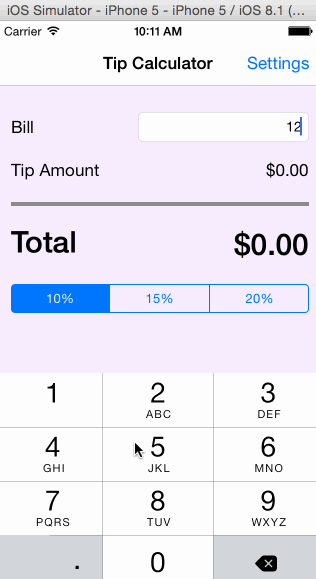

# TipCalculator

This is a Tip Calculator mobile app for iOS submitted as the [pre-work](http://courses.codepath.com/snippets/intro_to_ios/prework_objc.md) requirement for Codepath.

Time spent: 6 hours

Completed:

* [x] Required: User can enter a bill amount, choose a tip percentage, and see the tip and total values.
* [x] Required: Settings page to change a different tip percentages for minimum, custom and maximum.

Notes:

The code is based on Xcode 6.1. I used Main.storyboard for the View Controllers design and Controller nagivations and data exchange betwen Controllers.

GIF created with [LiceCap](http://www.cockos.com/licecap/).