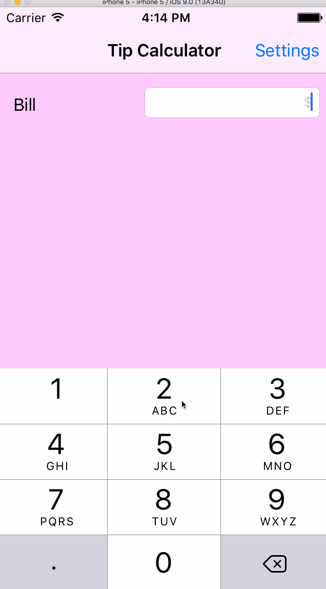

# TipCalculator

This is a Tip Calculator application for iOS submitted as the [pre-assignment](https://gist.github.com/timothy1ee/7747214) requirement for CodePath.

Time spent: 18 hours

Completed:

* [x] Required: User can enter a bill amount, choose a tip percentage, and see the tip and total values.
* [x] Required: Settings page to change a different tip percentages for minimum, custom and maximum. (I chose changing percetage values instead of selecting default, this is to explore the option of passing data between Controllers)
* [x] Optional: Remembering the bill amount across app restarts (if < 10mins)
* [x] Optional: Using locale-specific currency and currency thousands separators.
* [x] Optional: Making sure the keyboard is always visible and the bill amount is always the first responder. This way the user doesn't have to tap anywhere to use this app. Just launch the app and start typing.
* [x] Additional: Remembering the tip percentages and selected tip percentage across app restarts (there is NO < 10 mins restriction here)
* [x] Optional: Add animations to your UI
* [x] Optional: Add a light/dark color theme to the settings view. In viewWillAppear, update views with the correct theme colors.
* [x] Additional: Add region configuration to the app, the currency will be displayed based on region selected.
* [x] Additional: Add TipMode and TipSettingModel for related view controllers.
* [x] Additional: Use Table View Controller with static cells for views for Settings page.
* [x] Additional: Use Table View Controller with dynamic cells for view of Regions page.

Notes:

The code is based on Xcode 6.1. I used Main.storyboard for the View Controllers design and Controller nagivations and data exchange betwen Controllers. Majority of my time was spent on understanding storyboard features and interactions between controllers/AppDelegate, models and table view controllers.

GIF created with [LiceCap](http://www.cockos.com/licecap/).